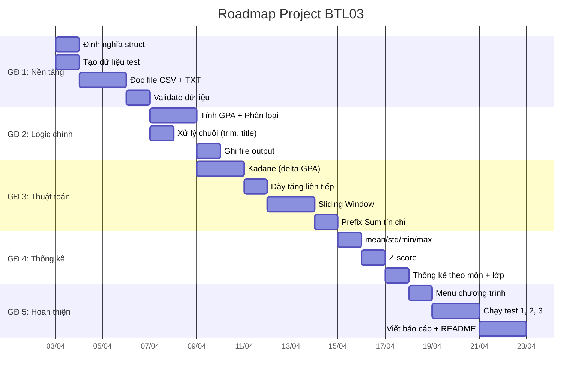

# 📋 KẾ HOẠCH PROJECT — Đề Tài 3: Hệ Thống Quản Lý Điểm & Phân Tích Học Lực Sinh Viên

## 1. Tổng Quan Đề Bài

| Hạng mục | Chi tiết |
|---|---|
| **Tên project** | Hệ thống quản lý điểm và phân tích học lực sinh viên |
| **Ngôn ngữ** | C++ |
| **Input** | `grades.csv`, `class.txt` |
| **Output (bắt buộc)** | `gpa_report.csv`, `progress.txt`, `ranking.csv` |
| **Output (phụ)** | `statistics.txt` (thống kê mô tả — đề không yêu cầu file riêng, nhưng nên có để trình bày) |
| **Kỹ thuật bắt buộc** | Struct lồng 3 cấp, File I/O (CSV), Kadane, Dãy tăng dài nhất liên tiếp, Sliding Window, Prefix Sum, Thống kê mô tả, Xử lý chuỗi, ≥3 bộ test |

---

## 2. Cấu Trúc Thư Mục Đề Xuất

```
BaiTapLon_DeTai3/
│
├── 📄 main.cpp                  # Entry point — menu chính, gọi các module
│
├── 📂 include/                  # Tất cả header files (.h)
│   ├── structs.h                # Định nghĩa struct: Grade, Student, Cohort
│   ├── file_io.h                # Đọc/ghi CSV, TXT
│   ├── gpa.h                    # Tính GPA, phân loại học lực
│   ├── algorithms.h             # Kadane, LIS liên tiếp, Sliding Window, Prefix Sum
│   ├── statistics.h             # Thống kê mô tả: mean, std, min, max, Z-score
│   ├── string_utils.h           # Chuẩn hoá tên: trim, title case
│   └── utils.h                  # Validate dữ liệu, sắp xếp kỳ học, tiện ích chung
│
├── 📂 src/                      # Tất cả source files (.cpp) — triển khai logic
│   ├── file_io.cpp              # Đọc grades.csv, class.txt; ghi output files
│   ├── gpa.cpp                  # Tính GPA từng SV, phân loại học lực
│   ├── algorithms.cpp           # Kadane, Dãy tăng liên tiếp, Sliding Window, Prefix Sum
│   ├── statistics.cpp           # Tính mean/std/min/max, Z-score
│   ├── string_utils.cpp         # Trim, title case, xử lý chuỗi
│   └── utils.cpp                # Validate điểm, tín chỉ, sắp xếp kỳ, tiện ích chung
│
├── 📂 data/                     # Dữ liệu input
│   ├── 📂 test1/                # Bộ test 1 — bình thường (nhiều SV, nhiều kỳ)
│   │   ├── grades.csv
│   │   └── class.txt
│   ├── 📂 test2/                # Bộ test 2 — biên (0 môn, điểm 0, 1 kỳ)
│   │   ├── grades.csv
│   │   └── class.txt
│   └── 📂 test3/                # Bộ test 3 — đặc biệt (tên sai, điểm sai, nhiều kỳ)
│       ├── grades.csv
│       └── class.txt
│
├── 📂 output/                   # Dữ liệu output (được tạo khi chạy)
│   ├── gpa_report.csv           # GPA từng SV
│   ├── progress.txt             # Đoạn kỳ tiến bộ + thuật toán
│   ├── ranking.csv              # Bảng xếp hạng
│   └── statistics.txt           # Thống kê mô tả theo môn + lớp
│
├── 📂 docs/                     # Tài liệu project
│   └── report.md                # Báo cáo (hoặc .docx/.pdf)
│
├── 📄 Makefile                  # Biên dịch tự động (g++ multi-file)
└── 📄 README.md                 # Hướng dẫn biên dịch + chạy project
```

> [!TIP]
> Tổng cộng khoảng **15–17 files** cần tạo. Chia module rõ ràng giúp dễ phân công cho 3 thành viên.
> Bỏ test4 vì đề chỉ yêu cầu ≥3 bộ, không cần thừa.

---

## 3. Mô Tả Chi Tiết Từng File

### 3.1 Struct — `include/structs.h`

```cpp
struct Grade {
    string subject;    // Tên môn học
    double score;      // Điểm (0–10)
    int credit;        // Số tín chỉ (> 0)
    string semester;   // Kỳ học, vd: "HK1_2024"
};

struct Student {
    string id;                // MSSV
    string name;              // Họ tên
    vector<Grade> grades;     // Danh sách điểm
    double gpa;               // GPA tổng
    string rank;              // Phân loại: "Xuất sắc", "Giỏi", ...
};

struct Cohort {
    string class_id;           // Mã lớp
    vector<Student> students;  // Danh sách SV
};
```

### 3.2 File I/O — `include/file_io.h` + `src/file_io.cpp`

| Hàm | Mô tả |
|---|---|
| `vector<Cohort> readData(string gradesFile, string classFile)` | Đọc CSV + TXT, nhóm Grade vào đúng Student, Student vào Cohort |
| `void writeGPAReport(string path, vector<Cohort>& cohorts)` | Ghi `gpa_report.csv` |
| `void writeProgress(string path, vector<Cohort>& cohorts, int k)` | Ghi `progress.txt` — cần `k` (kích thước cửa sổ Sliding Window) để tính + in kết quả |
| `void writeRanking(string path, vector<Cohort>& cohorts)` | Ghi `ranking.csv` |
| `void writeStatistics(string path, vector<Cohort>& cohorts)` | Ghi `statistics.txt` — thống kê theo môn + lớp + Z-score |
| `vector<string> splitCSVLine(string line)` | Tách dòng CSV bằng dấu phẩy |

### 3.3 GPA & Phân loại — `include/gpa.h` + `src/gpa.cpp`

| Hàm | Mô tả |
|---|---|
| `double calcGPA(vector<Grade>& grades)` | GPA = Σ(score × credit) / Σ(credit) |
| `vector<pair<string,double>> calcGPABySemester(...)` | GPA theo từng kỳ, **đã sắp xếp theo thứ tự thời gian** (trả về vector chứ không phải map, vì map không đảm bảo thứ tự đúng cho thuật toán) |
| `string classifyRank(double gpa)` | Phân loại: Xuất sắc (≥9), Giỏi (≥8), Khá (≥7), TB (≥5), Yếu (<5) |
| `void computeAllGPA(vector<Cohort>& cohorts)` | Tính GPA + rank cho toàn bộ SV |

### 3.4 Thuật toán — `include/algorithms.h` + `src/algorithms.cpp`

| Hàm | Kỹ thuật | Mô tả |
|---|---|---|
| `KadaneResult kadaneMaxGPA(vector<double>& deltaGPAs)` | **Kadane** | Áp dụng Kadane trên mảng **delta** (GPA_kỳ − GPA_TB), tìm đoạn kỳ học tốt nhất so với TB. Trả `struct KadaneResult { int start, end; double maxSum; }` |
| `StreakResult longestIncreasingStreak(vector<double>& semGPAs)` | **Dãy tăng liên tiếp** | Chuỗi kỳ GPA tăng dài nhất. Trả `struct StreakResult { int start, end, length; }` để biết đoạn nào |
| `vector<double> slidingAvgGPA(vector<double>& semGPAs, int k)` | **Sliding Window** | GPA trung bình trượt cửa sổ k kỳ |
| `bool detectDecline(vector<double>& slidingAvgs)` | **Sliding Window** | Phát hiện xu hướng sụt giảm: khi có ≥2 giá trị trung bình trượt liên tiếp giảm |
| `vector<int> prefixSumCredits(vector<Grade>& grades, vector<string>& semesters)` | **Prefix Sum** | Tín chỉ tích lũy theo kỳ |
| `int queryCredits(vector<int>& prefix, int l, int r)` | **Prefix Sum** | Truy vấn tổng tín chỉ đoạn [l,r] — O(1) |

> [!WARNING]
> **Bẫy Kadane**: Vì GPA luôn ≥ 0, nếu áp Kadane trực tiếp sẽ luôn trả về toàn bộ mảng. **Cách xử lý**: dùng mảng `delta[i] = GPA[i] - meanGPA` (lấy GPA từng kỳ trừ đi GPA trung bình của SV đó). Khi đó delta có cả giá trị âm lẫn dương → Kadane mới có ý nghĩa: tìm "giai đoạn học tốt nhất so với mức trung bình của chính SV".

### 3.5 Thống kê — `include/statistics.h` + `src/statistics.cpp`

| Hàm | Mô tả |
|---|---|
| `double mean(vector<double>& data)` | Trung bình |
| `double stdDev(vector<double>& data)` | Độ lệch chuẩn |
| `double minVal(vector<double>& data)` | Giá trị nhỏ nhất |
| `double maxVal(vector<double>& data)` | Giá trị lớn nhất |
| `vector<double> zScore(vector<double>& data)` | Chuẩn hoá Z-score: `z[i] = (x[i] - mean) / std` |
| `SubjectStats statsBySubject(vector<Cohort>& cohorts)` | Tính thống kê theo môn, trả struct chứa kết quả (để `writeStatistics` dùng) |
| `ClassStats statsByClass(vector<Cohort>& cohorts)` | Tính thống kê theo lớp, trả struct chứa kết quả |

### 3.6 Xử lý chuỗi — `include/string_utils.h` + `src/string_utils.cpp`

| Hàm | Mô tả |
|---|---|
| `string trim(string s)` | Xoá khoảng trắng đầu/cuối |
| `string toTitleCase(string s)` | Viết hoa chữ cái đầu mỗi từ |
| `string normalizeName(string name)` | Kết hợp trim + title case |

### 3.7 Validate & Tiện ích — `include/utils.h` + `src/utils.cpp`

| Hàm | Mô tả |
|---|---|
| `bool isValidScore(double score)` | Kiểm score ∈ [0, 10] |
| `bool isValidCredit(int credit)` | Kiểm credit > 0 |
| `void validateAndClean(vector<Cohort>& cohorts)` | Kiểm tra + cảnh báo/loại bỏ dữ liệu không hợp lệ |
| `vector<string> getSortedSemesters(vector<Grade>& grades)` | Trích + sắp xếp danh sách kỳ theo thứ tự thời gian |
| `int compareSemester(string a, string b)` | So sánh 2 semester (vd: HK1_2024 < HK2_2024 < HK1_2025) |

### 3.8 Main — `main.cpp`

```
Menu chính:
  1. Đọc dữ liệu từ file
  2. Tính GPA & Phân loại học lực
  3. Phân tích tiến bộ (Kadane + Dãy tăng)
  4. Phân tích xu hướng (Sliding Window)
  5. Truy vấn tín chỉ tích lũy (Prefix Sum)
  6. Thống kê mô tả (mean/std/min/max/Z-score)
  7. Xuất báo cáo (ghi file output)
  0. Thoát
```

---

## 4. Dữ Liệu Test — ≥ 3 Bộ (Bắt Buộc)

### Bộ Test 1 — Trường hợp bình thường (≥4 SV, ≥3 kỳ)
```csv
# grades.csv — cần đủ dữ liệu để test các thuật toán
student_id,name,subject,score,credit,semester
SV001,Nguyen Van An,Toan Cao Cap,8.5,3,HK1_2024
SV001,Nguyen Van An,Vat Ly,7.0,2,HK1_2024
SV001,Nguyen Van An,Hoa Hoc,9.0,3,HK2_2024
SV001,Nguyen Van An,Lap Trinh,8.0,4,HK2_2024
SV001,Nguyen Van An,XSTK,7.5,3,HK3_2024
SV001,Nguyen Van An,CTDL,9.5,4,HK3_2024
SV002,Tran Thi Binh,Toan Cao Cap,6.5,3,HK1_2024
SV002,Tran Thi Binh,Vat Ly,8.0,2,HK1_2024
SV002,Tran Thi Binh,Hoa Hoc,5.5,3,HK2_2024
SV002,Tran Thi Binh,Lap Trinh,6.0,4,HK2_2024
SV002,Tran Thi Binh,XSTK,7.0,3,HK3_2024
SV003,Le Van Cuong,Toan Cao Cap,9.0,3,HK1_2024
SV003,Le Van Cuong,Vat Ly,9.5,2,HK1_2024
SV003,Le Van Cuong,Hoa Hoc,8.5,3,HK2_2024
SV004,Pham Thi Dung,Toan Cao Cap,7.0,3,HK1_2024
SV004,Pham Thi Dung,Vat Ly,6.5,2,HK1_2024
```
```
# class.txt
LOP01
SV001
SV002
LOP02
SV003
SV004
```
> **Lưu ý**: SV001 có 3 kỳ, nhiều môn → đủ dữ liệu test Kadane, Sliding Window, dãy tăng, Prefix Sum.

### Bộ Test 2 — Trường hợp biên
- SV **không có môn nào** (0 grades)
- SV **chỉ có 1 kỳ** học
- Điểm **toàn 0**

### Bộ Test 3 — Trường hợp đặc biệt
- Tên SV có **khoảng trắng thừa**, **viết thường hết**
- Điểm **ngoài khoảng** [0,10] → test validate
- Tín chỉ **≤ 0** → test validate
- SV có **nhiều kỳ** (6-8 kỳ) → test thuật toán đầy đủ

---

## 5. Format File Input / Output

### `grades.csv` (Input)
```
student_id,name,subject,score,credit,semester
SV001,Nguyen Van An,Toan Cao Cap,8.5,3,HK1_2024
```

### `class.txt` (Input)
```
LOP01
SV001
SV002
SV003
LOP02
SV004
SV005
```
> **Quy ước**: Mã lớp bắt đầu bằng "LOP", MSSV bắt đầu bằng "SV". Dùng prefix này để phân biệt dòng nào là lớp, dòng nào là sinh viên khi đọc file.

### `gpa_report.csv` (Output)
```
student_id,name,class,gpa,rank
SV001,Nguyen Van An,LOP01,8.10,Gioi
```

### `progress.txt` (Output)
```
=== SV001 - Nguyen Van An ===
GPA theo kỳ: HK1_2024=7.90, HK2_2024=8.30, HK3_2024=8.80
Delta GPA (so với TB): -0.43, -0.03, 0.47
Đoạn kỳ học tốt nhất (Kadane trên delta): [HK3_2024 → HK3_2024], delta = +0.47
Chuỗi GPA tăng dài nhất: 3 kỳ liên tiếp
GPA trung bình trượt (k=2): 8.10, 8.55
Cảnh báo sụt giảm: Không
Tín chỉ tích lũy: HK1=5, HK1-HK2=8, HK1-HK3=11
```

### `ranking.csv` (Output)
```
rank,student_id,name,class,gpa,classification
1,SV003,Le Van Cuong,LOP02,9.20,Xuat Sac
2,SV001,Nguyen Van An,LOP01,8.10,Gioi
```

### `statistics.txt` (Output phụ — đề không bắt buộc, nhưng nên có)
```
=== THỐNG KÊ THEO MÔN ===
Toan Cao Cap: mean=7.50, std=1.20, min=5.00, max=9.50
Vat Ly:       mean=6.80, std=1.50, min=4.00, max=9.00

=== THỐNG KÊ THEO LỚP ===
LOP01: mean_GPA=7.90, std=0.85, min=6.20, max=9.20

=== Z-SCORE (Toan Cao Cap) ===
SV001: z=+0.83, SV002: z=-0.42, ...
```

---

## 6. Roadmap — Các Giai Đoạn Thực Hiện



---

## 7. Chi Tiết Từng Giai Đoạn

### 🔵 Giai đoạn 1: Nền tảng (Ngày 1–4)

| # | Việc cần làm | File liên quan | Output |
|---|---|---|---|
| 1.1 | Tạo cấu trúc thư mục | Tất cả folders | Thư mục sẵn sàng |
| 1.2 | Định nghĩa 3 struct: `Grade`, `Student`, `Cohort` | `include/structs.h` | Header file hoàn chỉnh |
| 1.3 | Tạo ≥3 bộ test data | `data/test1,2,3/` | CSV + TXT files |
| 1.4 | Viết hàm đọc CSV (split line, parse fields) | `src/file_io.cpp` | Đọc được grades.csv |
| 1.5 | Viết hàm đọc class.txt (nhóm SV vào lớp) | `src/file_io.cpp` | Đọc được class.txt |
| 1.6 | Kết hợp: nhóm Grade → Student → Cohort | `src/file_io.cpp` | Dữ liệu đúng cấu trúc |
| 1.7 | Validate: điểm [0,10], tín chỉ > 0 | `src/utils.cpp` | Cảnh báo dữ liệu sai |

### 🟢 Giai đoạn 2: Logic Chính (Ngày 5–7)

| # | Việc cần làm | File liên quan | Output |
|---|---|---|---|
| 2.1 | Tính GPA tổng cho mỗi SV | `src/gpa.cpp` | `student.gpa` được gán |
| 2.2 | Tính GPA theo từng kỳ (đã sort thời gian) | `src/gpa.cpp` | `vector<pair<semester, gpa>>` |
| 2.3 | Phân loại học lực (rank) | `src/gpa.cpp` | `student.rank` được gán |
| 2.4 | Chuẩn hoá tên SV: trim + title case | `src/string_utils.cpp` | Tên sạch đẹp |
| 2.5 | Ghi `gpa_report.csv` | `src/file_io.cpp` | File output |
| 2.6 | Ghi `ranking.csv` (sắp xếp GPA giảm dần) | `src/file_io.cpp` | File output |

### 🟡 Giai đoạn 3: Thuật Toán (Ngày 8–13)

| # | Việc cần làm | Kỹ thuật | File liên quan |
|---|---|---|---|
| 3.1 | Tạo mảng GPA theo kỳ từ `calcGPABySemester` | Chuẩn bị | `src/algorithms.cpp` |
| 3.2 | **Kadane's Algorithm**: tính delta = GPA_kỳ − GPA_TB, tìm đoạn delta max | Kadane | `src/algorithms.cpp` |
| 3.3 | **Dãy tăng liên tiếp**: tìm streak GPA tăng dài nhất | Dãy con | `src/algorithms.cpp` |
| 3.4 | **Sliding Window**: GPA trung bình trượt k kỳ | Sliding Window | `src/algorithms.cpp` |
| 3.5 | **Phát hiện sụt giảm**: từ mảng trung bình trượt | Sliding Window | `src/algorithms.cpp` |
| 3.6 | **Prefix Sum**: tín chỉ tích lũy theo kỳ | Prefix Sum | `src/algorithms.cpp` |
| 3.7 | **Truy vấn O(1)**: tổng tín chỉ đoạn [l,r] | Prefix Sum | `src/algorithms.cpp` |
| 3.8 | Ghi `progress.txt` | File I/O | `src/file_io.cpp` |

### 🟠 Giai đoạn 4: Thống Kê Mô Tả (Ngày 14–16)

| # | Việc cần làm | File liên quan |
|---|---|---|
| 4.1 | Tính mean, std, min, max cho điểm | `src/statistics.cpp` |
| 4.2 | Chuẩn hoá Z-score | `src/statistics.cpp` |
| 4.3 | Thống kê theo **môn học** | `src/statistics.cpp` |
| 4.4 | Thống kê theo **lớp** | `src/statistics.cpp` |
| 4.5 | In kết quả thống kê ra console / ghi file | `src/statistics.cpp` |

### 🔴 Giai đoạn 5: Hoàn Thiện (Ngày 17–21)

| # | Việc cần làm | File liên quan |
|---|---|---|
| 5.1 | Xây menu chương trình (switch-case) | `main.cpp` |
| 5.2 | Kết nối tất cả module vào main | `main.cpp` |
| 5.3 | Chạy test bộ 1 — bình thường | `data/test1/` |
| 5.4 | Chạy test bộ 2 — biên (0 môn, điểm 0, 1 kỳ) | `data/test2/` |
| 5.5 | Chạy test bộ 3 — đặc biệt (tên sai, điểm sai) | `data/test3/` |
| 5.6 | Fix bugs, edge cases | Tất cả |
| 5.7 | Viết `README.md` (hướng dẫn chạy) | `README.md` |
| 5.8 | Viết báo cáo project | `docs/report.md` |
| 5.9 | Tạo `Makefile` (tuỳ chọn) | `Makefile` |

---

## 8. Checklist Yêu Cầu Kỹ Thuật

| STT | Yêu cầu | Trạng thái |
|---|---|---|
| 1 | [x] Struct lồng nhau 3 cấp (Cohort → Student → Grade) | Hoàn thành |
| 2 | [x] Đọc/ghi File CSV + TXT | Hoàn thành |
| 3 | [x] Validate điểm [0,10], tín chỉ > 0 | Hoàn thành |
| 4 | [x] Tính GPA từ grades[] | Hoàn thành |
| 5 | [x] Kadane — đoạn kỳ học tốt nhất *(áp trên delta = GPA_kỳ − GPA_TB, xem bẫy #1 mục 10)* | Hoàn thành |
| 6 | [x] Dãy tăng liên tiếp — streak GPA tăng | Hoàn thành |
| 7 | [x] Sliding Window — GPA trung bình trượt k kỳ | Hoàn thành |
| 8 | [x] Sliding Window — phát hiện sụt giảm | Hoàn thành |
| 9 | [x] Prefix Sum — tín chỉ tích lũy | Hoàn thành |
| 10 | [x] Prefix Sum — truy vấn O(1) đoạn [l,r] | Hoàn thành |
| 11 | [x] Thống kê: mean/std/min/max | Hoàn thành |
| 12 | [x] Z-score | Hoàn thành |
| 13 | [x] Thống kê theo môn + theo lớp | Hoàn thành |
| 14 | [x] Xử lý chuỗi: trim, title case | Hoàn thành |
| 15 | [x] Phân loại học lực theo chuỗi rank | Hoàn thành |
| 16 | [x] ≥ 3 bộ test | Hoàn thành |
| 17 | [x] Test biên: SV 0 môn | Hoàn thành |
| 18 | [x] Test biên: điểm toàn 0 | Hoàn thành |
| 19 | [x] Test biên: 1 kỳ học | Hoàn thành |

---

## 9. Tóm Tắt Số Lượng

| Loại | Số lượng |
|---|---|
| **Header files** (.h) | 7 |
| **Source files** (.cpp) | 7 (6 module + 1 main) |
| **Data files** (test) | 6 (2 files × 3 bộ test) |
| **Output files** | 4 (thêm statistics.txt) |
| **Docs** | 2 (README + report) |
| **Config** | 1 (Makefile) |
| **Tổng files** | ~**27 files** |

---

## 10. ⚠️ Lưu Ý Quan Trọng & Bẫy Thường Gặp

| # | Vấn đề | Giải thích | Cách xử lý |
|---|---|---|---|
| 1 | **Kadane trên GPA dương** | GPA ∈ [0,10] → luôn ≥0 → Kadane luôn trả toàn bộ mảng → vô nghĩa | Tính `delta[i] = GPA_ky[i] - mean_GPA` rồi áp Kadane trên mảng delta |
| 2 | **Thứ tự kỳ học** | `map<string,double>` không đảm bảo thứ tự thời gian, "HK1_2024" < "HK2_2024" theo alphabet nhưng "HK10_2024" thì sai | Viết hàm `compareSemester()` parse số HK + năm để sort đúng |
| 3 | **class.txt phân biệt lớp/SV** | File không có header → cần quy ước rõ | Dùng prefix: "LOP" = mã lớp, "SV" = MSSV |
| 4 | **SV trong grades.csv không có trong class.txt** | Dữ liệu không khớp | Gom vào cohort "UNKNOWN" hoặc bỏ qua + cảnh báo |
| 5 | **SV 0 môn** | `grades` rỗng → GPA = 0/0 → NaN | Kiểm tra `grades.empty()` trước khi chia, gán GPA = 0 |
| 6 | **1 kỳ duy nhất** | Kadane, Sliding Window, dãy tăng đều trivial | Xử lý riêng: trả kết quả đơn giản, không crash |
| 7 | **CSV có dấu phẩy trong tên** | "Nguyen Van An" bình thường, nhưng nếu tên có dấu phẩy thì split sai | Giả sử tên không chứa dấu phẩy (ghi rõ trong README) |

> [!IMPORTANT]
> Tất cả **19 yêu cầu kỹ thuật** trong bảng checklist phải được hoàn thành. Đặc biệt chú ý **bẫy #1 (Kadane)** và **bẫy #2 (thứ tự kỳ)** — đây là 2 lỗi phổ biến nhất khi làm đề này.
